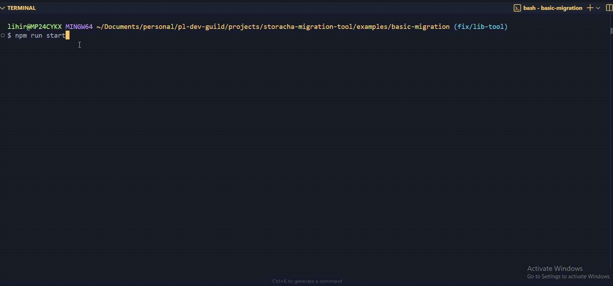

# Storacha Migration Tool

A robust library for migrating files and directories from AWS S3 to Storacha (Web3.Storage).

## Installation

```bash
npm install storacha-migration-tool
```

## Prerequisites

You'll need:
- AWS S3 credentials (access key and secret key)
- A Storacha (Web3.Storage) email account
- Node.js version 16 or higher

## Migration Tool Demo




## Basic Usage

```typescript
import { StorachaMigrator } from 'storacha-migration-tool';

const migrator = new StorachaMigrator({
  s3: {
    bucketName: process.env.S3_BUCKET_NAME,
    region: process.env.S3_REGION,
    credentials: {
      accessKeyId: process.env.AWS_ACCESS_KEY_ID,
      secretAccessKey: process.env.AWS_SECRET_ACCESS_KEY
    }
  },
  storacha: {
    email: process.env.STORACHA_EMAIL
  },
  retry: {
    maxAttempts: 3,
    backoffMs: 1000,
    maxBackoffMs: 10000
  },
  batch: {
    concurrency: 5,
    size: 10
  }
});

// Initialize connections
await migrator.initialize();

// Migrate a single file
const fileResult = await migrator.migrateFile('path/to/file.txt');
console.log('File CID:', fileResult.cid);

// Migrate an entire directory
const dirResult = await migrator.migrateDirectory('path/to/directory');
console.log('Directory CID:', dirResult.cid);

// Clean up
await migrator.close();
```

## Features

- Single file migration
- Directory migration with batch processing
- Progress tracking
- Error handling and retries
- Type safety with TypeScript
- Secure credential management

## Configuration Options

### S3 Configuration
- \`bucketName\`: Your S3 bucket name
- \`region\`: AWS region (e.g., 'us-east-1')
- \`credentials\`: AWS credentials
  - \`accessKeyId\`: AWS access key
  - \`secretAccessKey\`: AWS secret key

### Storacha Configuration
- \`email\`: Your Web3.Storage email address

### Retry Configuration
- \`maxAttempts\`: Maximum retry attempts (default: 3)
- \`backoffMs\`: Initial backoff time in milliseconds (default: 1000)
- \`maxBackoffMs\`: Maximum backoff time in milliseconds (default: 10000)

### Batch Configuration
- \`concurrency\`: Number of concurrent uploads (default: 5)
- \`size\`: Batch size for directory uploads (default: 10)

## Event Handling

Track progress and handle errors:

```typescript
// Progress tracking
migrator.onProgress((progress) => {
  console.log(\`Migration progress: \${progress.percentage}%\`);
  console.log(\`Completed: \${progress.completedFiles} of \${progress.totalFiles}\`);
});

// Error handling
migrator.onError((error, fileKey) => {
  console.error(\`Error migrating \${fileKey}: \${error.message}\`);
});
```

## Running the Example

1. Clone the repository:
```bash
git clone <repository-url>
cd storacha-migration-tool
```

2. Install dependencies:
```bash
npm install
npm run build
```

3. Set up the example:
```bash
cd examples/basic-migration
npm install
```

4. Create a \`.env\` file in the example directory:
```env
AWS_ACCESS_KEY_ID=your_access_key
AWS_SECRET_ACCESS_KEY=your_secret_key
S3_BUCKET_NAME=your_bucket_name
S3_REGION=your_region
STORACHA_EMAIL=your_email@example.com
```

5. Run the example:
```bash
npm start
```

## Error Handling

The library includes robust error handling:
- Automatic retries with exponential backoff
- Detailed error messages
- File-specific error tracking
- Connection error handling

## Best Practices

1. Always initialize the migrator before use
2. Use environment variables for sensitive credentials
3. Implement proper error handling
4. Close the migrator when done
5. Monitor progress for large migrations
6. Use appropriate batch sizes for your use case

## Contributing

Contributions are welcome! Please read our contributing guidelines for details.

## License

ISC License
